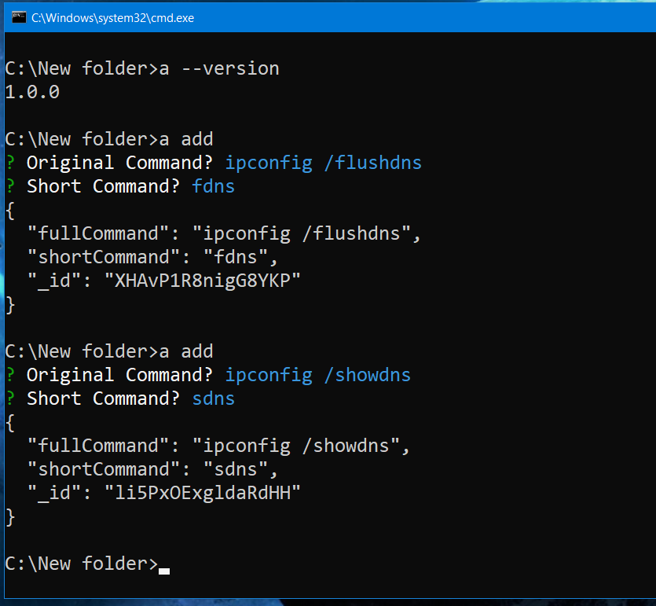
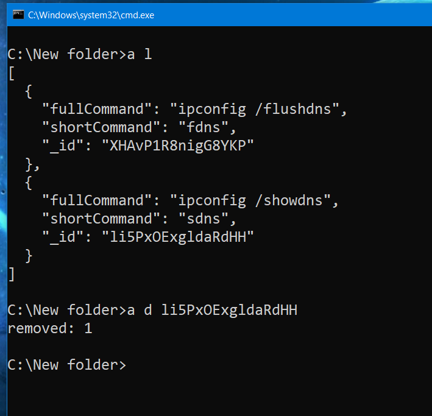
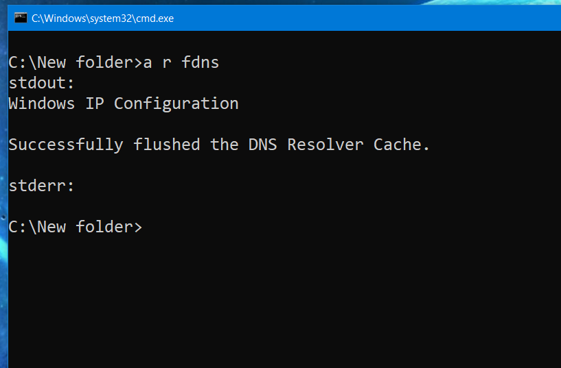

# Command Clipper

## Installation:
* Enter the following command in the terminal:  `git clone https://github.com/aayushdutt/command-clipper.git && cd command-clipper && npm start`
#### OR
* Clone the repository.
* `cd` into the cloned directory by `cd command-clipper`.
* Run `npm start` in terminal.
* Ready to roll!

## Docs:
### Usage:
* Check installation by `a --version`.

1. `a add`:  Adds a command.
    * **Alias**: `a a`
    * Original Command : Long command which needs to be shortened.
    * Short Command : Shortened version.
    * Use `a run <short_command>` to run the long command.
    

2. `a list`:  Displays a lists all shortened commands in JSON format.
    * **Alias**: `a l`

3. `a find <short_command>`:  Finds a command with its short command.
    * **Alias**: `a f <name>`

4. `a update <_id>`:  Updates an existing shortened command.
    * **Alias**: `a u <_id>`

5. `a delete <_id>`:  Delete an existing shortened command by id.
    * **Alias**: `a d <_id>`

6. `a run <name>`:  Runs the command by its short command and displays resultant output.
    * **Alias**: `a r <name>`

